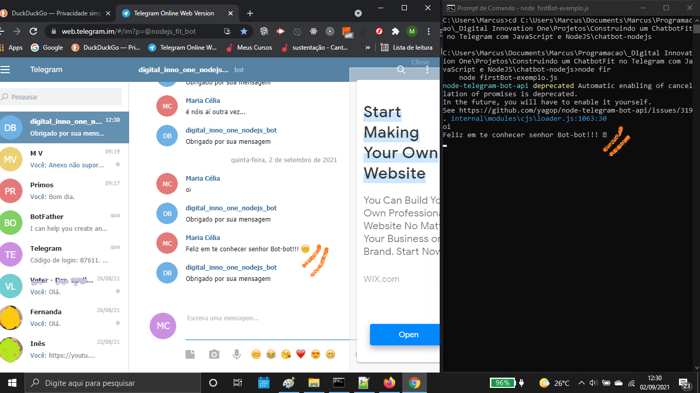

# Construindo um ChatbotFit no Telegram com JavaScript e NodeJS

O projeto vai desenvolver um chatbot aplicando conceitos de integração entre o Noje-JS, o Telegram e serviços da Google (Dialogflow e Youtube). [^1]

 

Dependências:

- Node-telegram-bot-api
- Dialogflow
- Youtube-node

 

### Imagem inicial do projeto ChatbotFit integrado com o Telegram:

 

### 

 

### 

[^1] Orientação do professor Carlos Gomes da Digital Innovation One.

